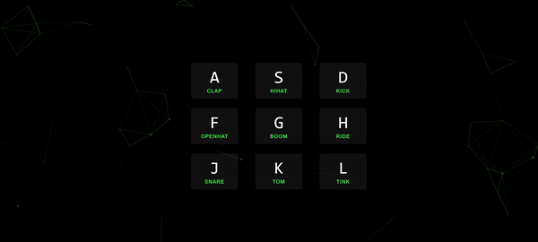

# Drum-Key

Drum-Key is a simple drum beat simulator, that produces beats on key strokes. For now, we have 9 beats, each associated with a keyboard key stroke.

## Installation

This is a stand alone code built completely using HTML, CSS, and pure **vanilla JavaScript**.

Check out the live demo of Drum-Kit [here](Project link will be updated soon)

## Learning

I learnt how much we could implement and execute with simple vanilla JavaScript. This would help in the future to write leaner yet efficient code using large frameworks like React.js or Vue.js

## Contributing

Pull requests are welcome. For major changes, please open an issue first
to discuss what you would like to change.

Please make sure to update tests as appropriate.

## Attribution

This project was built with the help of Wes, following along his course on [JavaScript 30 Challenege](https://javascript30.com/).

## License

[MIT](https://choosealicense.com/licenses/mit/)
