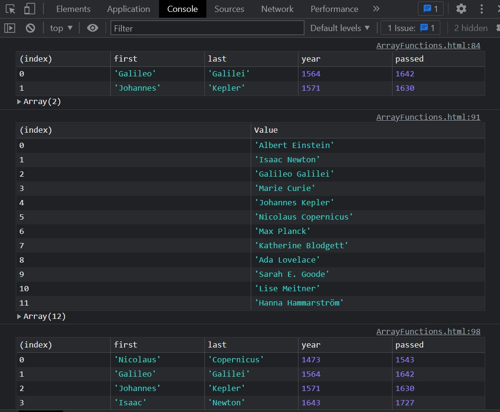

# Array Functions Exploration

Just exploring and learning existing array functions like mao, filter, sort, reduce etc.

## Installation

This is a stand alone code built completely using HTML, CSS, and pure **vanilla JavaScript**.

## Learning

Specially learnt and revised concepts in:

- Array Functions
  - Reduce
  - Sort
  - Map
  - Filter
  - Combinations of the above
- A new .table function for the console.

## Contributing

Pull requests are welcome. For major changes, please open an issue first
to discuss what you would like to change.

Please make sure to update tests as appropriate.

## Attribution

This project was built with the help of Wes, following along his course on [JavaScript 30 Challenege](https://javascript30.com/).

## License

[MIT](https://choosealicense.com/licenses/mit/)
