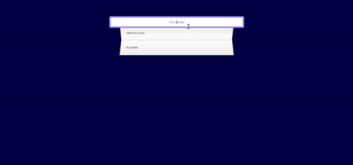

# Ajax and Regex

A whole lot of Ajax and regex with find and replacing functions!

## Installation

This is a stand alone code built completely using HTML, CSS, and pure **vanilla JavaScript**.

## Learning

Specially learnt and revised concepts in:

- Adding Event Listeners like keyup, change etc.
- CSS Styling and Animations
  - Flexbox, align items
  - first-child, nth-child selectors
  - Background Transition Effects
- Dyanamic CSS variables
  - with Regex
- Inline CSS

## Contributing

Pull requests are welcome. For major changes, please open an issue first
to discuss what you would like to change.

Please make sure to update tests as appropriate.

## Attribution

This project was built with the help of Wes, following along his course on [JavaScript 30 Challenege](https://javascript30.com/).

## License

[MIT](https://choosealicense.com/licenses/mit/)
